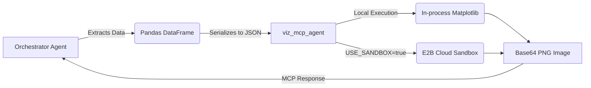

# 📊 Visualization Agent (MCP Microservice)


A high-performance, stateless data visualization microservice designed specifically for **Multi-Agent Systems** via the Model Context Protocol (MCP). 

Instead of generating raw Python code and hoping it runs, this agent operates as a **secure rendering engine**. A data-profiling agent simply sends structured JSON data to this service, and it returns a beautifully styled, production-ready Base64 PNG chart.

---

## ✨ Key Features

- **🎨 13 Beautiful Chart Types:** Built-in support for Bar, Line, Scatter, Area, Stacked/Grouped Bar, Dual Axis Time Series, Correlation Matrix, and more.
- **🛡️ 100% Secure Execution:** Uses parameterized decorators (`@viz_tool`) and hardcoded plotting logic to prevent arbitrary remote code execution (RCE) vulnerabilities. 
- **☁️ E2B Cloud Sandbox Integration:** Built-in seamless support for routing rendering tasks to isolated [E2B Cloud Sandboxes](https://e2b.dev/). 
- **⚡ Stateless & Blazing Fast:** Designed as a pure functional pipeline (`Data In → PNG Out`). Includes lazy-loading to optimize Cold Starts.
- **🔌 Multi-Agent Ready:** Powered by `FastMCP` over STDIO/SSE, making it a drop-in tool for any LLM Orchestrator.

---

## 🏗️ Architecture

This agent uses a **JSON-Serialization Pipeline**:



---

## 🛠️ Installation

```bash
# 1. Clone the repository
git clone https://github.com/yourusername/viz_mcp_agent.git
cd viz_mcp_agent

# 2. Create a virtual environment
python -m venv .venv
source .venv/bin/activate  # (Windows: .venv\Scripts\activate)

# 3. Install requirements
pip install -r requirements.txt
```

---

## 🚀 Usage Configuration

The agent can run in two modes controlled by your `.env` file:

### 1. Local Mode (Default & Fastest)
Charts are rendered directly inside the MCP process using local memory. Best for trusted data.
```env
USE_SANDBOX=false
```

### 2. Cloud Sandbox Mode (Most Secure)
Charts are shipped to an isolated E2B Cloud Sandbox. Best for multi-tenant environments or parsing highly sensitive untrusted data formats.
```env
USE_SANDBOX=true
E2B_API_KEY=your_e2b_key_here
SANDBOX_TIMEOUT=300
```

---

## 🧪 Testing the Tools Locally

You can run an instant smoke test to generate all 13 supported chart types and verify your environment is working accurately:

```bash
python test_tools.py
```
*Outputs will be saved in the `./test_output` directory.*

---

## 🧰 Available MCP Tools

When the orchestrator connects, the following `mcp.tool` definitions are automatically exposed:

| Tool Name | Best Used For |
| :--- | :--- |
| `bar_chart` | Categorical volume comparisons |
| `line_chart` | Time series & continuous trends | 
| `scatter_plot` | Correlation between 2 numeric variables |
| `histogram` | Distribution of a single numerical column |
| `box_plot` | Outliers & spread across categories |
| `heatmap` | 2D density/intensity analysis |
| `pie_chart` | Proportional market share (max 8 slices) |
| `area_chart` | Cumulative volume over time |
| `stacked_bar_chart` | How sub-groups contribute to a total column |
| `grouped_bar_chart` | Side-by-side metric comparison |
| `correlation_matrix` | Multi-collinearity & feature relationships |
| `count_plot` | Pure frequency counting by class |
| `dual_axis_time_series`| Two different metrics with different scales (e.g. Sales vs Temperature) |

---

## 📡 Example MCP Payload

This is how an orchestrator agent calls the plotting service over MCP:

```json
{
  "tool_name": "bar_chart",
  "x_values": ["Jan", "Feb", "Mar", "Apr"],
  "y_values": [120, 150, 130, 180],
  "x_label": "Financial Month",
  "y_label": "Revenue (USD)",
  "title": "Q1 Revenue Growth"
}
```

The agent processes this JSON and returns:
```json
{
  "success": true,
  "image_base64": "iVBORw0KGgoAAAANSUhEUgAAA...",
  "metadata": {"rendered_in": "local"}
}
```
